# Miners

Predicting Rent Prices Using Machine Learning Models

## Team Members - Nilay, Mariia, Vasco, Sindhuj

## Problem Statement  
Understanding rental price trends is crucial for tenants, landlords, and real estate investors. Our project aims to build predictive models that estimate rental prices based on various factors, such as location, property size, number of rooms, amenities, and prices from previous periods.  We aim to provide insights into the key drivers of rental costs and improve pricing transparency in the real estate market by using different but complementary approaches.
 
- **First approach:** A 'cross-sectional' analysis using features of each listed property to estimate rental prices.  
- **Second approach:** A 'time-series' analysis covering a longer timeframe, calculating average daily prices for two regions to forecast future rental prices.

## Cross-Sectional Models  
 
### Data Sources and Collection Method  
Data was scraped from the MagicBricks website for six cities: Bangalore, Hyderabad, Mumbai, New Delhi, Kolkata, and Chennai. Due to website limitations, the HTML had to be copied into `.txt` files before further processing.  

This dataset has missing values, especially in categorical features, as noted in the missing.py file. No clear patterns are found, but two features have over 2,500 missing values. We will treat missing values in categorical variables as a separate category in our models.
 
### Columns/Features  
- **Property ID:** Unique identifier for each listing.  
- **Furnishing:** Categorical variable describing furnishing extent.  
- **Bathroom:** Number of bathrooms.  
- **Tenant Preference:** Preferred tenant type.  
- **Availability:** Acceptable move-in dates.  
- **Floors:** Floor number and total floors in the property.  
- **Facing:** Direction property faces.  
- **Overlooking:** View the property offers.  
- **Balcony:** Number of balconies.  
- **Ownership:** Ownership type.  
- **Property Type:** Apartment or house.  
- **Latitude and Longitude:** Coordinates.  
- **Address Region:** City location.  
- **Rental Start/End Time:** Lease period.  
- **Price:** Monthly rental price.  
- **Area:** Square footage of the property.
## Time Series Analysis  
  
### Data Sources  
- Data [from Kaggle](https://www.kaggle.com/datasets/iamsouravbanerjee/house-rent-prediction-dataset?resource=download&select=House_Rent_Dataset.csv), scraped from MagicBricks.  
- Complete dataset (no missing values). 

### Features  
- **BHK:** Number of bedrooms/halls/kitchens.  
- **Rent:** Monthly rent.  
- **Size:** Square footage.  
- **Floor:** Floor number.  
- **Area Type/Locality:** Description of location.  
- **City:** City where property is located.  
- **Furnishing Status:** Furnished, semi-furnished, or unfurnished.  
- **Tenant Preferred:** Owner’s preference.  
- **Bathroom:** Number of bathrooms.  
- **Point of Contact:** Who to contact.

The data lacks details like precise locations (latitude/longitude) and specific bedroom counts (only total BHK is available). While not critical for model estimation, including time-varying and regional variables (e.g., building age, population growth, crime rates) could have improved predictive power.

### Limitations  
1.  Chennai and Hyderabad have only 74-75 observations, limiting predictions to short-term trends.
2.  Predictions can’t cover the entire country due to regional trends and missing data for some cities.
3.  Varying observation counts across cities restrict the analysis to only the two cities with the most data.
4.  Static variables, like apartment size or bedroom count, cannot be included in the time-based analysis.
5.  Missing data on time-varying features and regional factors limits model accuracy and predictive power.

### Modeling Approaches  
- **Exploratory Plots:** No clear seasonal patterns initially observed.  

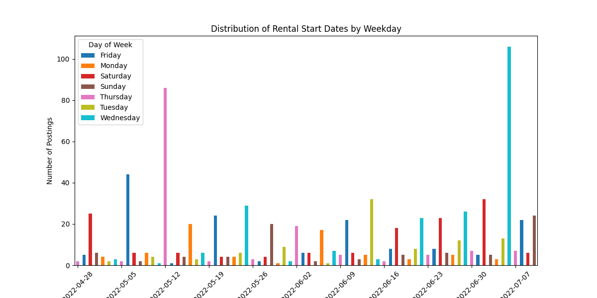
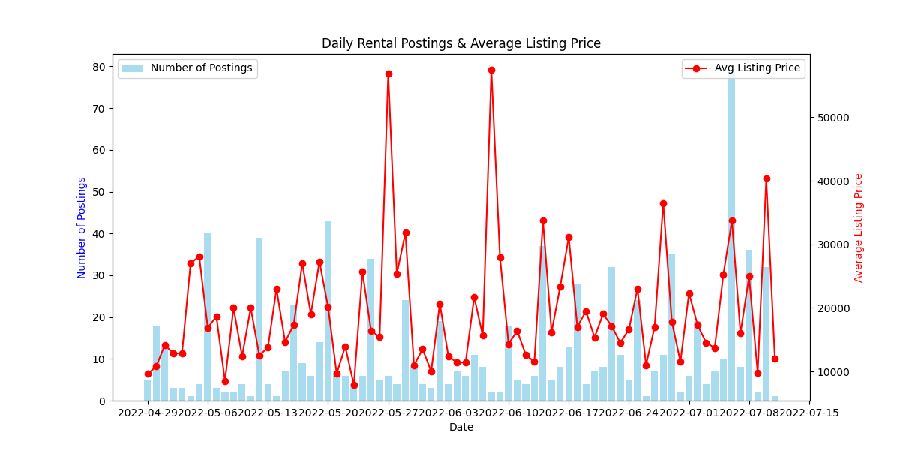

- **Decomposition:** Weekly seasonality found in both cities.  

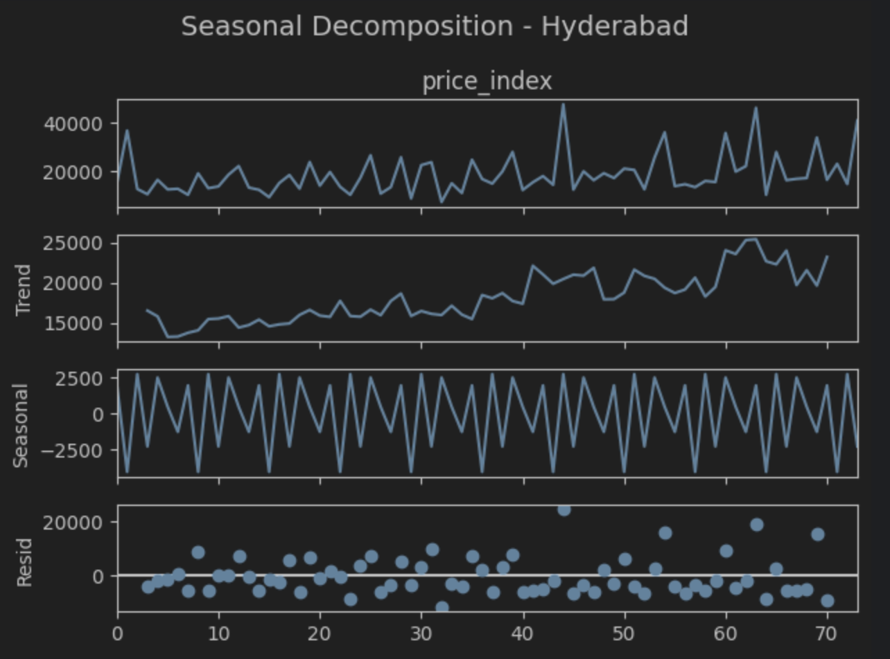
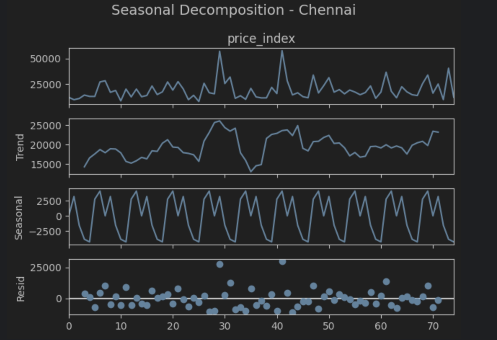

- **ADF Test:** Confirmed stationarity for Chennai; differencing required for Hyderabad.  

| City       | ADF Statistic       | p-value               | Stationarity   |
|------------|---------------------|-----------------------|----------------|
| Hyderabad  | -0.69               | 0.85                  | Non-stationary |
| Chennai    | -8.34               | 3.25e-13              | Stationary     |
| 1st Diff (Hyderabad) | -6.38       | 2.2269532e-08                | Stationary     |

- **ACF & PACF:** 

We created plots to visually identify model parameters and considered ARIMA due to noticeable lags in both AR and MA models. Multiple ARIMA model versions were estimated for a more rigorous approach.
  
### Modeling ARIMA 

We evaluated several ARIMA models using AIC and BIC, expecting at least one AR and one MA component (with differencing for Hyderabad and no differencing for Chennai). ARIMA (1, 1, 2) was the best model for Hyderabad, and ARIMA (0, 0, 0) was the best for Chennai based on both rankings. 
| **Hyderabad**|            |**Chennai**|            |
|------------|------------|------------|------------|
| Order      | AIC        | Order      | AIC        |
| (1, 1, 2)  | 1526.168442 | (0, 0, 0)  | 1589.923826 |
| (0, 1, 2)  | 1530.206146 | (1, 0, 0)  | 1591.689138 |
| (0, 1, 1)  | 1534.434114 | (0, 0, 1)  | 1591.703274 |
| (1, 1, 1)  | 1532.461179 | (0, 0, 2)  | 1593.244788 |
| (2, 1, 1)  | 1532.482322 | (2, 0, 0)  | 1593.393681 |

### Modeling SARIMA 
As mentioned, we observed seasonality after decomposition and wanted to include it in our model. We chose SARIMA (Seasonal ARIMA) with a seasonal component of 7 (7 days). Our goal was to see if this improved the model in terms of AIC, and it did. The best models we identified were:

- **Hyderabad:** SARIMA(1,1,2,0,0,1,7), AIC: 1320
- **Chennai:** SARIMA(1,0,2,0,0,1,7) , AIC: 1392

We conducted the Ljung-Box and ARCH tests, confirming no autocorrelation or heteroscedasticity in the residuals. For forecasting, we selected SARIMA(1,1,2,0,0,1,7) for Hyderabad and SARIMA(1,0,2,0,0,1,7) for Chennai.
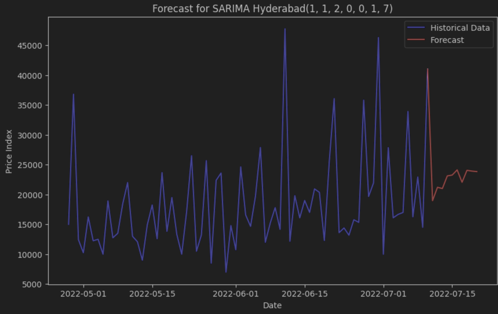
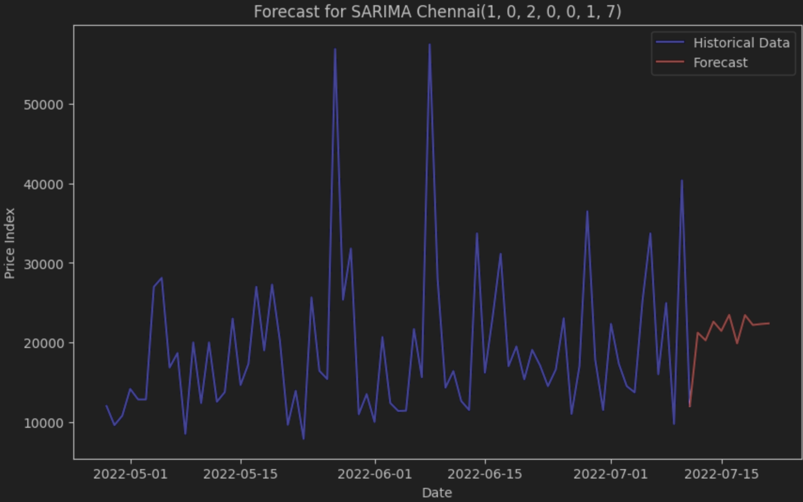

### Model Performance  

These plots show forecasted values 10 periods ahead for each of the regions. As is typical with these types of models, the predictions closely follow the mean of the series (which happens because our models assume stationarity).  

| Region | MAE | MSE |  
|--------|------|------|  
| Hyderabad | 8995.99 | 138,888,235 |  
| Chennai | 7716.65 | 80,176,964 |  
  
In time series modeling, we used a sequential train-test split, with the last 10 observations as the test set and the rest as training. Given our limited data (around 70 observations per city), the predictions were suboptimal, likely due to the small sample size.

Hyderabad 

Chennai
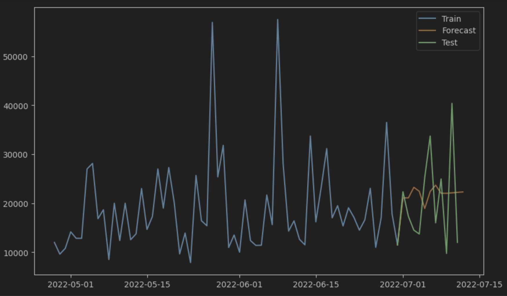

**Rolling Forecasting:** 
To improve model performance, we used a rolling train-test scheme, where the training set expands with each new observation. Based on MAE and MSE, this approach performed better for Hyderabad but worse for Chennai. While the model captured some real data fluctuations, predictions were not perfect.

| Region | MAE | MSE |  
|--------|------|------|  
| Hyderabad | 7709.93 | 116,800,466 |  
| Chennai | 8342.6 | 90,204,823 |  

Hyderabad 
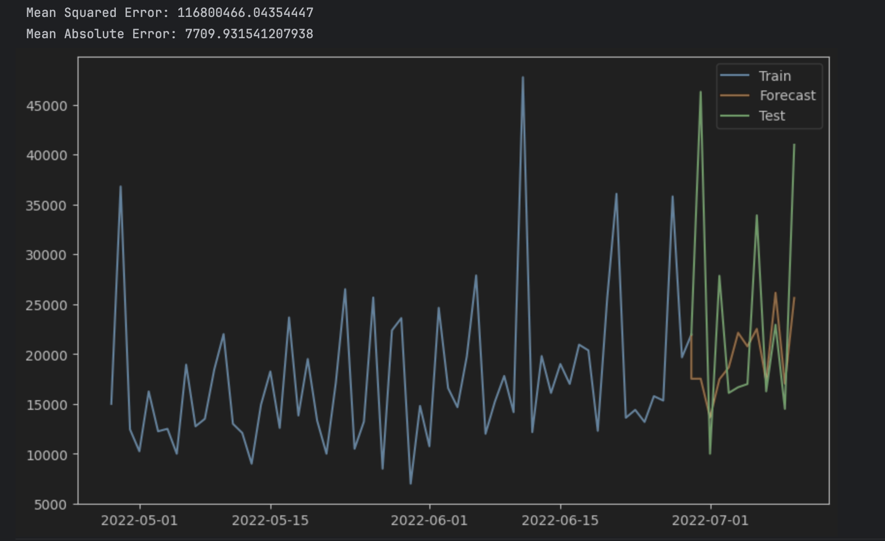
Chennai
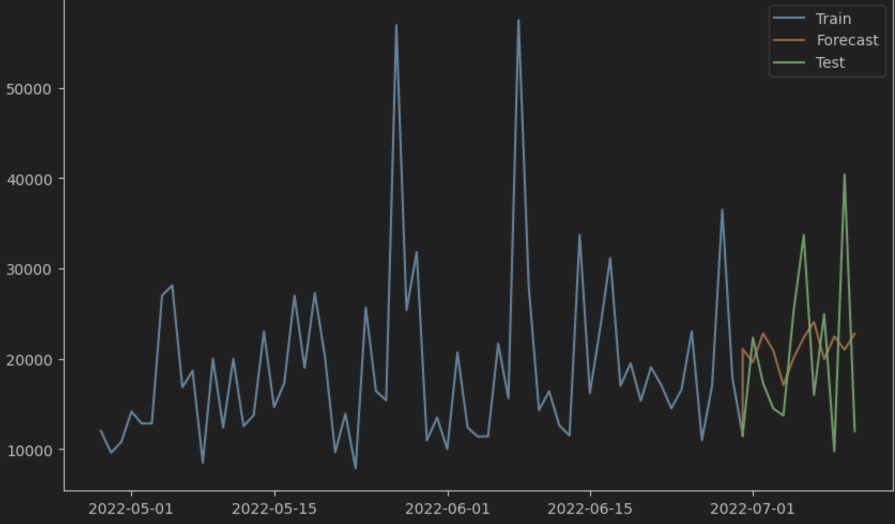

#### Limitations of the model 
-   The model cannot capture all fluctuations and is limited to short-term predictions due to a lack of data.
-   ARIMA and SARIMA only model data based on past observations, requiring other models for additional variables.
-   These models assume stationarity, forcing data transformations that may reduce model flexibility.
  
### Extensions  
- Consider adding **economic indicators** like **unemployment rate** or **interest rates** as exogenous variables. These factors influence property prices and can enhance prediction accuracy when included in a **SARIMAX** model. 
-   Scrape more data for additional days to increase the sample size and enhance the model’s predictive power.
-   With more data, higher-order parameters for the ARIMA and SARIMA models could be used, as the limited 70+ observations restricted us to 3 or fewer parameters for the MA and AR parts.
  
## Reproducibility  
- Code and datasets are available in a public GitHub repository.  
- README includes setup instructions.  
- All preprocessing steps are documented.  
- Required packages listed in `requirements.txt`.  
  
## Conclusion  
Machine learning models were developed to predict rental prices, aiding tenants and landlords. Future improvements include real-time data updates and enhanced predictive features.

## Appendix

1.  Clone the repository
    
2.  Install the required dependencies using requirements.txt
    
3.  Run the code in the file scraper.py to collect the cross-sectional data from the necessary HTML files
    
4.  Run the code in the file cleaner.py to clean and convert variables into the desired format for cross-sectional models
    
5.  Run the code in the file lasso.py for LASSO Regression models
    
6.  Run the code in the file knn_tree.py for KNN and RANDOM FOREST Regression models
    
7.  Run the code in the file timeseriesanalysis.py to check plots for obvious seasonal patterns
    
8.  Run the code in the file chennaitimeseries.py for modeling specific to Chennai
    
9.  Run the code in the file hyderabadtimeseries.py for modeling specific to Hyderabad

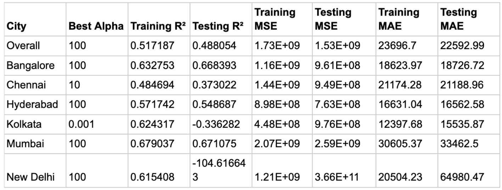
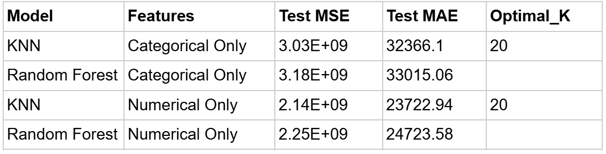
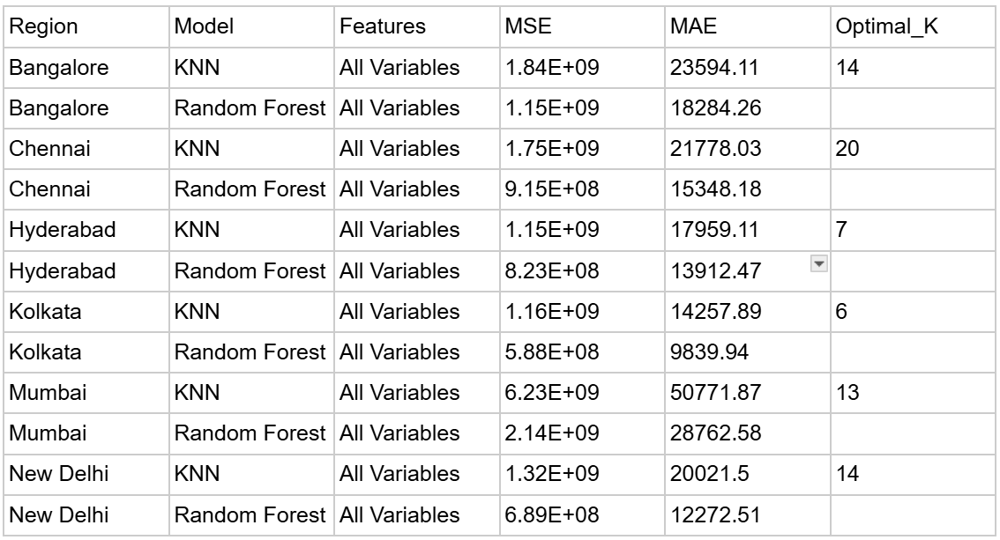
